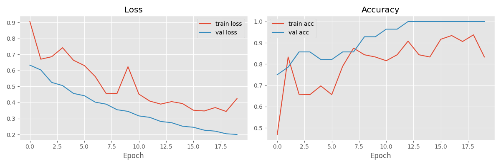

# 😷 Face Mask Detection System


A deep learning-based **Face Mask Detection System** that detects whether a person is wearing a mask or not using images and real-time webcam input.

This project uses **MobileNetV2 (Transfer Learning)** for classification and **OpenCV DNN** for face detection.

---

## 🚀 Features

* 📸 Image-based mask detection using Streamlit Web App
* 🎥 Real-time face mask detection using webcam
* 🧠 Transfer Learning with MobileNetV2
* 📊 Training visualization (Accuracy & Loss)
* ⚡ Fast and lightweight model

---

## 🎥 Demo

### 📊 Training Output



### 📸 Image Detection (Streamlit)

(Add your screenshot here → improves project quality 🔥)

### 🎥 Real-Time Detection

(Add webcam screenshot or GIF here)

---

## 🛠️ Tech Stack

* Python
* TensorFlow / Keras
* OpenCV
* Streamlit
* NumPy, Matplotlib, Scikit-learn

---

## 📂 Project Structure

```bash
face-mask-detection-system/
│── app.py
│── detect_realtime.py
│── train_model.py
│── requirements.txt
│── README.md
│── training_plot.png
│── models/
│    ├── mask_detector.h5
│    ├── deploy.prototxt
│    └── res10_300x300_ssd_iter_140000.caffemodel
```

---

## 📊 Model Performance

* Training Accuracy: ~94%
* Validation Accuracy: ~96%

---

## 📁 Dataset

Dataset used: **Face Mask Detection Dataset (Kaggle)**

* Total Images: 7553
* Classes:

  * 😷 With Mask
  * ❌ Without Mask

👉 Dataset link: https://www.kaggle.com/datasets/omkargurav/face-mask-dataset

---

## ⚙️ Installation

### 1️⃣ Clone the repository

```bash
git clone https://github.com/shanmukha0527/face-mask-detection-system.git
cd face-mask-detection-system
```

### 2️⃣ Install dependencies

```bash
pip install -r requirements.txt
```

---

## ▶️ Usage

### 🔹 Run Streamlit Web App

```bash
streamlit run app.py
```

Upload an image → detect mask instantly.

---

### 🔹 Run Real-Time Detection

```bash
python detect_realtime.py
```

Press **Q** to exit webcam.

---

### 🔹 Train the Model

```bash
python train_model.py
```

---

## ⚡ How It Works

1. Face detection using OpenCV DNN
2. Extract face region
3. Resize to 224×224
4. MobileNetV2 predicts mask / no mask
5. Bounding box + label displayed

---

## ⚠️ Important Notes

* Do NOT upload sensitive files like `kaggle.json`
* Dataset is not included (download from Kaggle)
* Model file can be large — use GitHub or Drive

---

## 📌 Future Improvements

* 🔔 Alert system for no-mask detection
* 📊 Count number of people without mask
* 🌐 Deploy Streamlit app online
* 📱 Improve UI/UX

---

## 👨‍💻 Author

**Gondrala Shanmukha Akhilesh**
B.Tech CSE (AI & ML)

---

## ⭐ Support

If you like this project, give it a ⭐ on GitHub!
